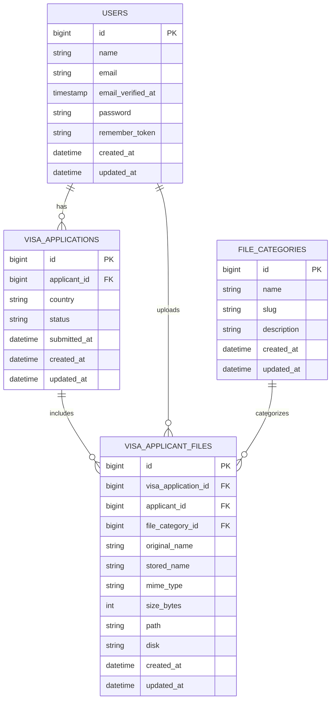

# Data Model: VISA Application System

## Entity Overview
- **User**: Registers/logs in, can create multiple visa applications.
- **VisaApplication**: Created by a user, holds metadata about the visa request.
- **VisaApplicantFile**: Uploaded document, linked to a specific visa application.
- **FileCategory**: Categorizes the type of uploaded file.

---

## Tables & Relationships

### users
| Field               | Type      | Description                |
|---------------------|-----------|----------------------------|
| id                  | bigint    | Primary key (auto-increment) |
| name                | string    | User's name                |
| email               | string    | Unique email               |
| email_verified_at   | timestamp | Email verification date    |
| password            | string    | Hashed password            |
| remember_token      | string    | Session token              |
| created_at          | timestamp | Registration date          |
| updated_at          | timestamp | Last update                |

### visa_applications
| Field         | Type      | Description                |
|---------------|-----------|----------------------------|
| id            | bigint    | Primary key (auto-increment) |
| applicant_id  | bigint    | FK to users                 |
| country       | enum      | Country code (ISO 3166-1 alpha-2) |
| status        | enum      | Application status: draft, submitted, approved, rejected |
| submitted_at  | timestamp | When submitted             |
| created_at    | timestamp | Creation date              |
| updated_at    | timestamp | Last update                |

### file_categories
| Field         | Type      | Description                |
|---------------|-----------|----------------------------|
| id            | bigint    | Primary key (auto-increment) |
| name          | string    | Category name (e.g., passport, photo) |
| slug          | string    | URL-friendly unique identifier |
| description   | string    | Human-readable description  |
| created_at    | timestamp | Creation date              |
| updated_at    | timestamp | Last update                |

### visa_applicant_files
| Field               | Type      | Description                |
|---------------------|-----------|----------------------------|
| id                  | bigint    | Primary key (auto-increment) |
| visa_application_id | bigint    | FK to visa_applications      |
| applicant_id        | bigint    | FK to users (redundant, for direct file ownership) |
| file_category_id    | bigint    | FK to file_categories         |
| original_name       | string    | Original filename          |
| stored_name         | string    | Name used in storage       |
| mime_type           | string    | MIME type                  |
| size_bytes          | integer   | File size in bytes         |
| path                | string    | Storage path               |
| disk                | string    | Filesystem disk name       |
| created_at          | timestamp | Upload date                |
| updated_at          | timestamp | Last update                |

---

## Model Descriptions & Relationships

- **User** (`users`): Represents a registered user. Has many `VisaApplication` and `VisaApplicantFile`.
- **VisaApplication** (`visa_applications`): Created by a user (applicant). Has many `VisaApplicantFile`. Belongs to `User`.
- **FileCategory** (`file_categories`): Defines the type of uploaded file. Has many `VisaApplicantFile`.
- **VisaApplicantFile** (`visa_applicant_files`): Uploaded document linked to a specific visa application, categorized by `FileCategory`. Belongs to `VisaApplication`, `User`, and `FileCategory`.

---

## Model Classes & Relationships

- **User** (`User` model, `users` table):
  - Has many `VisaApplication` (via `applicant_id`)
  - Has many `VisaApplicantFile` (via `applicant_id`)

- **VisaApplication** (`VisaApplication` model, `visa_applications` table):
  - Belongs to `User` (via `applicant_id`)
  - Has many `VisaApplicantFile` (via `visa_application_id`)

- **FileCategory** (`FileCategory` model, `file_categories` table):
  - Has many `VisaApplicantFile` (via `file_category_id`)

- **VisaApplicantFile** (`VisaApplicantFile` model, `visa_applicant_files` table):
  - Belongs to `VisaApplication` (via `visa_application_id`)
  - Belongs to `User` (via `applicant_id`)
  - Belongs to `FileCategory` (via `file_category_id`)

---

## Entity Relationship Diagram (Mermaid)

---

## Notes
- Each user can have multiple visa applications.
- Each visa application can have multiple uploaded files.
- All relationships are enforced via foreign keys.
- Extend `VisaApplication` with more fields as needed (e.g., type).
- Add authentication and authorization for user access control.
- `status` enum values: `draft`, `submitted`, `approved`, `rejected`

---

## Seeder Example: file_categories

Seed with:
- name: "Visa Application Form", slug: "visa_application_form", description: "Filled visa application form"
- name: "ID Photos", slug: "id_photos", description: "Passport-sized photographs"
- name: "Passport Document", slug: "passport_document", description: "Scanned passport copy"
