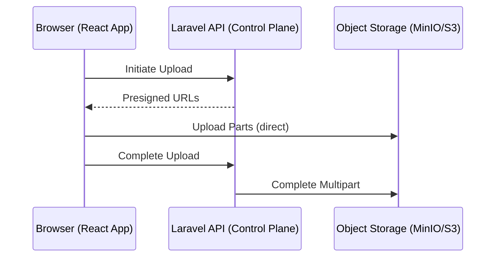

# Direct-to-Object-Storage Multipart Upload Pattern

## Overview

The **Direct-to-Object-Storage Multipart Upload Pattern** enables large files to be uploaded directly from the browser to an object storage service such as Amazon S3 or MinIO. By using pre-signed URLs for each part of the file, the upload bypasses the application server entirely for data transfer, reducing server load and improving upload speed and scalability.

This approach is particularly useful when handling very large files, as it allows the browser to upload parts in parallel, pause and resume uploads, and retry failed parts without restarting the entire upload.

---

## Architecture

This pattern separates the **control plane** and **data plane**:

- **Control Plane (Laravel API):** Handles authentication, upload session management, metadata validation, and generating pre-signed URLs for each upload part.
- **Data Plane (MinIO/S3):** Handles the actual file data upload via pre-signed URLs directly from the browser.

The browser acts as the orchestrator, coordinating between the control plane and data plane.

### Mermaid Diagram

---

## Flow Steps

1. **Initiate Multipart Upload**

   - The browser requests the Laravel API to initiate a multipart upload.
   - Laravel validates metadata and creates a multipart upload session with the object storage.
   - Laravel returns an upload ID and pre-signed URLs for each part.

2. **Upload Parts in Parallel**

   - The browser splits the file into chunks (parts).
   - Each chunk is uploaded directly to the object storage using its respective pre-signed URL.
   - Uploads can be performed in parallel for speed.
   - Failed parts can be retried independently.

3. **Complete Upload**

   - After all parts are uploaded successfully, the browser notifies the Laravel API to complete the multipart upload.
   - Laravel calls the object storage API to assemble the parts into the final object.
   - Laravel may dispatch jobs for post-processing (e.g., generating thumbnails).

4. **Abort if Needed**

   - If the upload is cancelled or fails irrecoverably, the browser or Laravel API can abort the multipart upload.
   - This releases storage resources and cleans up partial uploads.

---

## Key Advantages

- **Speed:** Parallel uploads of parts maximize bandwidth utilization.
- **Resumability:** Uploads can be paused and resumed without starting over.
- **Progress Tracking:** Each part’s progress can be tracked individually.
- **Retry per Part:** Failed parts can be retried independently, improving reliability.
- **Reduced Backend Load:** Data flows directly from browser to object storage, minimizing server bandwidth and CPU usage.

---

## Laravel Responsibilities

- Validate upload metadata and permissions.
- Initiate multipart upload sessions with the object storage.
- Generate pre-signed URLs for each part.
- Complete or abort multipart uploads.
- Dispatch background jobs for post-upload processing (e.g., thumbnails, text extraction).
- Optionally implement auto-cleanup of incomplete or abandoned multipart uploads.

---

## React Router Responsibilities

- Chunk files into appropriately sized parts.
- Manage concurrent uploads with configurable concurrency limits.
- Handle retries and exponential backoff for failed parts.
- Support pause and resume functionality.
- Persist upload state locally (e.g., `localStorage`) for recovery.
- Revalidate and refresh the file list after upload completion.

---

## Comparison to Laravel Queue Uploads

- **Laravel Queues** are primarily used for **post-processing** tasks such as generating thumbnails, running OCR (Textract), or transcoding.
- Queues are **not** used for moving bytes during upload.
- Direct-to-object-storage uploads offload the data transfer to the client and storage service, while queues handle asynchronous backend processing after upload.

---

## Resilience and Recovery

- **User Reloads or Quits:**
  - Upload state is saved in `localStorage` to allow resuming on page reload.
  - Upon resuming, the client can query the server or object storage for existing parts.

- **Server Side Recovery:**
  - Laravel can use the object storage’s `ListParts` API to reconcile incomplete uploads.
  - Scheduled jobs can clean up abandoned multipart upload sessions.

- **Lifecycle Rules:**
  - Object storage lifecycle rules can automatically abort or delete incomplete multipart uploads after a configurable timeout.

---

## Glossary and References

- **Multipart Upload:** A feature of object storage that allows large files to be uploaded as multiple parts, which are later combined.
- **Multipart/Form-Data:** An HTTP content type used for submitting forms that include files; different from multipart upload in object storage.

### Useful Documentation Links

- AWS S3 Multipart Upload:
  - https://docs.aws.amazon.com/AmazonS3/latest/userguide/mpuoverview.html
  - https://docs.aws.amazon.com/AmazonS3/latest/API/API_CreateMultipartUpload.html
  - https://docs.aws.amazon.com/AmazonS3/latest/API/API_UploadPart.html
  - https://docs.aws.amazon.com/AmazonS3/latest/API/API_CompleteMultipartUpload.html

- MinIO Multipart Upload:
  - https://docs.min.io/docs/multipart-upload-how-to.html
  - https://docs.min.io/docs/minio-client-complete-multipart-upload.html

- React Multipart Upload Libraries:
  - https://github.com/okonet/react-dropzone
  - https://github.com/aws/aws-sdk-js-v3/tree/main/clients/client-s3

---
